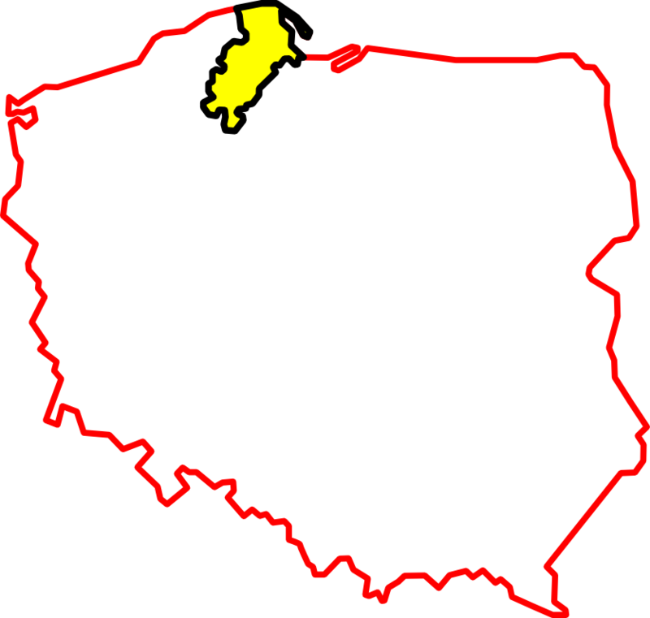

# Polish-Kashubian Translator Project

The project consists of a Polish-Kashubian translator based on a seq2seq model, enhanced by an attention mechanism.

The model was trained and evaluated using the Polish-Kashubian Parallel Translation Corpus (Olewniczak et al., 2024).


**Kashuby** (kaszub. Kaszëbë or Kaszëbskô) - cultural region in northern Poland, part of Gdansk Pomerania. It is inhabited, among others, by Kashubians (indigenous Pomeranians) (_Kaszuby_, 2024). Kashubian has had regional language status in Poland since 2005, and is spoken daily by 87.6 thousand people (_Język kaszubski_, 2024).



## Dataset: Polish-Kashubian parallel translation corpus

The data set contains about 120,000 Polish words and sentences and their translations into Kashubian. It was created using two types of sources: online dictionaries and an existing dataset. The dataset was pre-cleaned and duplicates were removed (Olewniczak et al., 2024).


## Installation 
1. Clone the repository
    ```bash
   git clone git@github.com:mariah881/polkash_translator_project.git
    ```
2. Navigate to the project directory
    ```bash
    cd polkash_translator_project
    ```
3. Install dependencies
    ```bash
    pip install -r requirements.txt
    ```
4. Download the model from HuggingFace using the link:
    [Polkash_translator_project Hugging Face](https://huggingface.co/hmaria/polkash_translator_project)
4. Run the command below to load the model and perform inference:
    ```bash
    cd python
    python inference.py
    ```


## Pipeline

- **Preprocessing** (`preprocessing.py`) – Tokenizes and prepares data.
- **Model Definition** (`model.py`) – Implements a Seq2Seq model with attention.
- **Training** (`train.py`) – Trains the model on Polish → Kashubian translation.
- **Inference** (`interference.py`) – Translates sentences using the trained model.


1. `preprocessing.py` (Data Preprocessing)​
Handles data preparation, including tokenization, vocabulary creation, and padding.
Key Functions:
- `define_vocab` – Reads a vocabulary file, cleans it, and assigns indices to words.
- `sentence_to_indices` – Converts a tokenized sentence into a list of word indices.
- `process_files` – Tokenizes sentences and converts them into index lists.
- `pad_sentences` – Adjusts sentence length by padding or truncating.
- `load_data` – Loads vocabularies, processes sentences, and returns data loaders.

2. `model.py` (Seq2Seq Model)​
Defines the Seq2Seq model with GRU and attention.
Key Classes:
- `EncoderGRU` – Encodes input sentences using embeddings and a GRU.
- `Attention` – Computes attention weights for better translation.
- `DecoderGRU` – Decodes the sentence using attention and a GRU, predicting the next word.
- `Seq2Seq` – Combines encoder, decoder, and attention into a full translation model.
- `create_model` – Builds and returns the Seq2Seq model.

3. `train.py` (Training the Model)​
Handles model training, optimization, and early stopping.
Key Functions:
- `setup_and_train` – Loads data, initializes the model, sets up the optimizer/loss, and starts training.
- `train_model` – Trains the model, evaluates on test data, and saves the best-performing model.

4. `interference.py` (Inference)
Performs sentence translation using the trained model.
Key Functions:
- `load_vocab_from_json` – Loads a vocabulary from a JSON file with a size limit.
- `inference` – Tokenizes input, converts it to indices, runs inference, and reconstructs the translated sentence.


## References

Olewniczak, S., Nowak, M., Szweda, F., Źęgota, J., Kulpiński, K., Wrzosek, M., Grzybowski, J., & Czepiel, K. (2024). Polish-Kashubian parallel translation corpus (Version 1.0, 1–) [Dataset]. Gdańsk University of Technology. https://doi.org/10.34808/t930-fs97

Wikipedia contributors. (2024). Język kaszubski. Wikipedia, The Free Encyclopedia. Retrieved March 7, 2025, from https://pl.wikipedia.org/wiki/Język_kaszubski

Wikipedia contributors. (2024). Kaszuby. Wikipedia, The Free Encyclopedia. Retrieved March 7, 2025, from https://pl.wikipedia.org/wiki/Kaszuby


